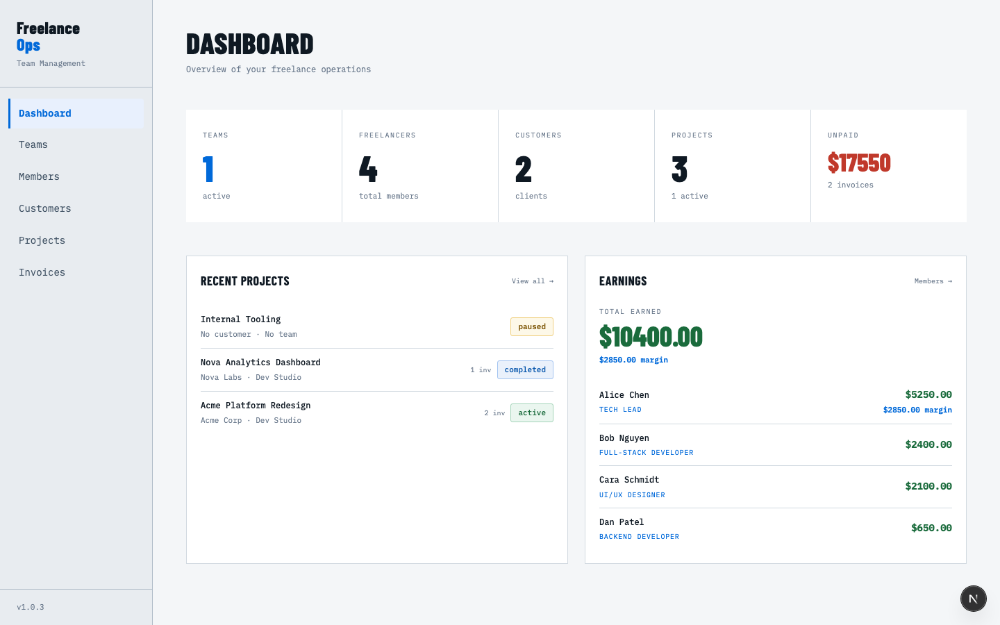
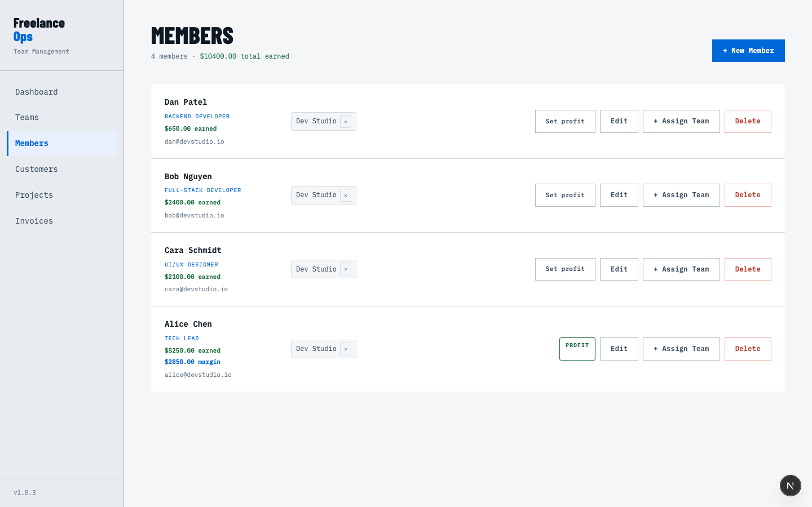
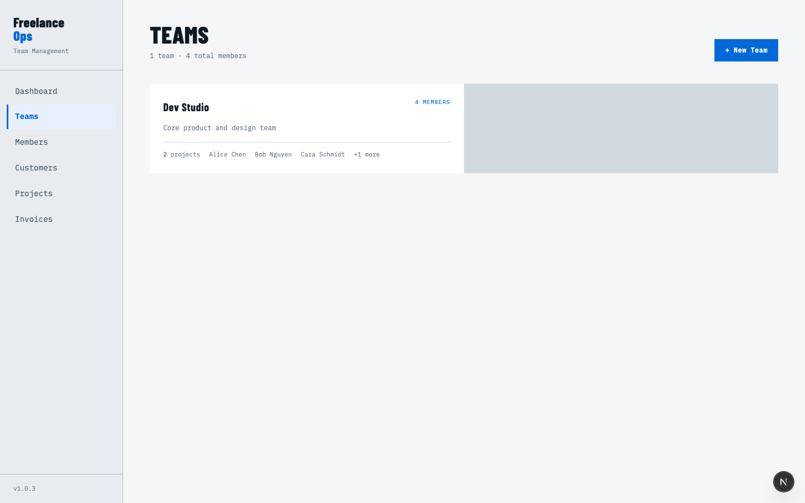
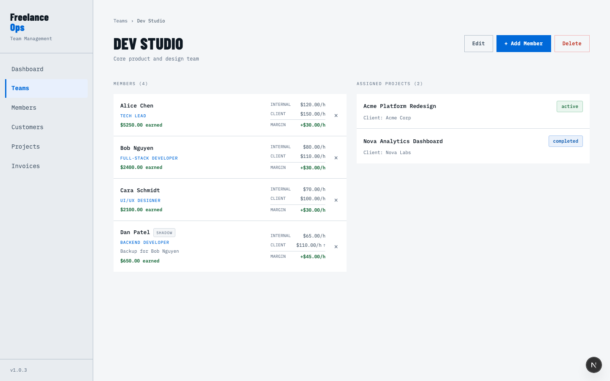
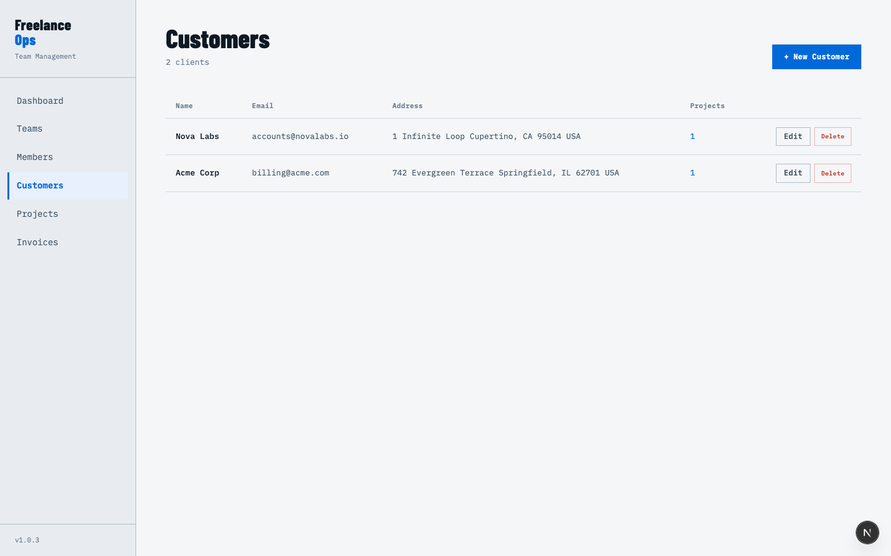
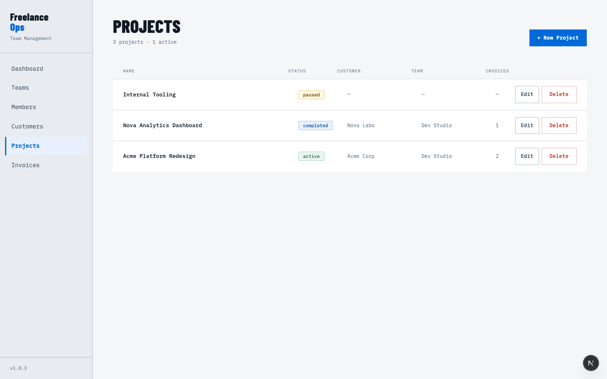
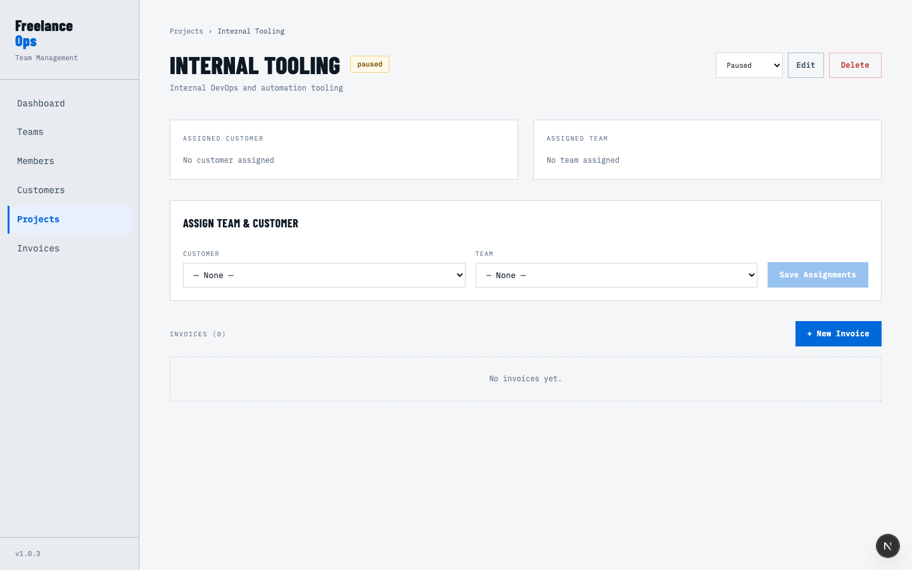
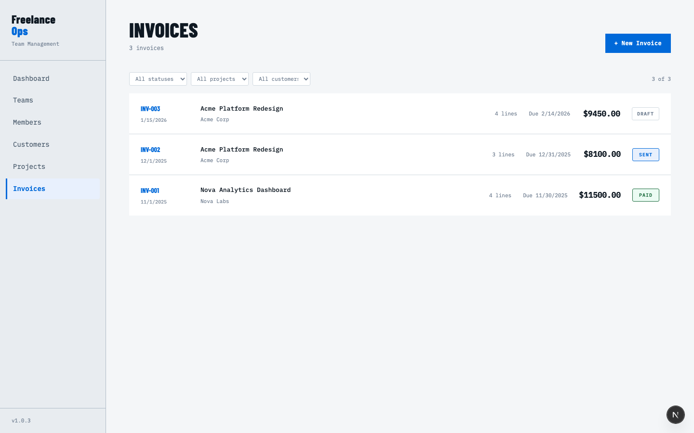
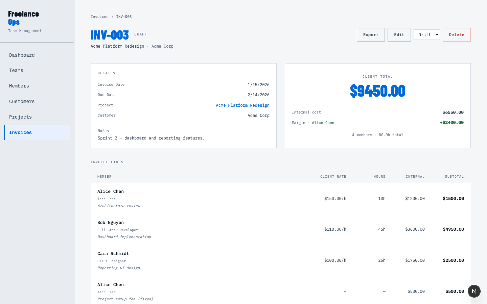

# FreelanceOps

A self-hosted freelance operations tool for managing teams, projects, and invoices. Built for small agencies and independent contractors who need clean billing workflows without SaaS overhead.

---

## What It Does

**FreelanceOps** tracks the full lifecycle of freelance work — from assembling teams to sending paid invoices.

- **Teams & Members** — Organize freelancers into teams. Assign roles, set internal and client rates, and designate shadow members (backups for primary roles).
- **Customers & Projects** — Maintain a client database and link projects to customers and teams. Track project status from active through completion.
- **Invoices** — Create itemized invoices with hourly or fixed-rate line items, optional tax, and a draft → sent → paid status workflow.
- **Earnings Tracking** — Automatically records member earnings when invoices are marked paid. Tracks margins for profit members.
- **PDF Export** — Generate clean, professional PDF invoices ready to send to clients.

---

## Screenshots

### Dashboard

The dashboard gives an at-a-glance view of your operation — active teams, total freelancers, clients, open projects, and total unpaid invoice value. The earnings panel breaks down what each member has earned across all paid invoices.



---

### Members

Each member has a role, contact email, and optionally a profit member flag for margin tracking. Members can be assigned to multiple teams with different rates per team.



---

### Teams

Teams group members together and are assigned to projects. The team list shows member counts and linked projects.



---

### Team Detail

Inside a team you can see each member's internal rate (what you pay them), client rate (what you bill the client), and the resulting margin per hour. Shadow members — backups for a primary role — are labeled and inherit the primary's client rate.



---

### Customers

Customers hold billing contact information and are linked to projects. Address is stored in full for PDF invoice generation.



---

### Projects

Projects link a customer to a team and track status across four states: active, paused, completed, and cancelled. Each project shows how many invoices have been created against it.



---

### Project Detail

From a project's detail page you can assign a customer and team, change the project status, and create new invoices. All invoices for the project are listed with their status and total value.



---

### Invoices

The invoices list shows all invoices across all projects with their status (draft / sent / paid), associated project and customer, and total amount.



---

### Invoice Detail

An invoice shows the full line-item breakdown — member name, description, rate, hours worked, internal cost, and client subtotal. The summary panel shows client total, internal cost, and margin. Invoices can be exported to PDF at any status, and status can be advanced through the draft → sent → paid workflow.



---

## Typical Workflow

```
1. Create members (freelancers)
       ↓
2. Create a team — add members, set internal & client rates
       ↓
3. Create a customer (client)
       ↓
4. Create a project — assign customer + team
       ↓
5. Create an invoice on the project — add line items per member
       ↓
6. Mark invoice as sent  →  then paid
       ↓
7. Earnings are recorded per member; margins tracked for profit member
```

---

## Stack

| Layer | Technology |
|---|---|
| Framework | Next.js 16 (App Router, Turbopack) |
| Language | TypeScript 5 |
| Database | SQLite via Prisma 7 + `better-sqlite3` |
| Styling | Tailwind CSS 4 + custom design tokens |
| PDF | `pdf-lib` |
| Runtime | Node 20 |

No external services required. Everything runs locally or in a single container.

---

## Getting Started

### Local Development

```bash
npm install
npx prisma generate
npm run dev
```

App runs at [http://localhost:3000](http://localhost:3000).

The SQLite database lives at `prisma/dev.db` and is created automatically on first run.

### Docker

```bash
docker compose up
```

Uses the prebuilt image from Docker Hub (`hoangdieuctu/freelancerops`). The database is persisted in a named volume (`db_data`) mounted at `/app/prisma`.

To build your own image:

```bash
docker build -t freelanceops .
```

---

## Project Structure

```
app/
  page.tsx                    # Dashboard
  teams/                      # Team management
  members/                    # Member management
  customers/                  # Customer database
  projects/                   # Project tracking
  invoices/                   # Invoice workflow
  api/invoices/[id]/pdf/      # PDF export endpoint
  actions/                    # Server actions (mutations)
  components/                 # Shared UI components
lib/
  prisma.ts                   # Prisma singleton
prisma/
  schema.prisma               # Data model
  migrations/                 # Migration history
```

---

## Data Model

```
Team ──< TeamMember >── Member
          │
          └── internalRate, clientRate, shadowOf?

Customer ──< Project ──< Invoice ──< InvoiceLine ── TeamMember
                              │
                              └── Earning ── Member
```

Key concepts:
- **Shadow member** — A backup for a primary team member. Shares the primary's client rate but can have a different internal rate.
- **Profit member** — A member flagged for margin tracking. The margin (client rate − internal rate) is recorded as a separate earning.
- **Earnings** — Created when an invoice is marked paid. Tied to individual members via invoice lines.

---

## Invoice Workflow

```
draft  →  sent  →  paid
```

- Editing is only allowed on `draft` invoices.
- Earnings are recorded when an invoice transitions to `paid`.
- PDF export is available on any invoice status.

---

## Environment

The only required environment variable:

```env
DATABASE_URL="file:./dev.db"
```

This is committed in `.env` — no secrets required for local setup.

---

## Scripts

```bash
npm run dev      # Development server with Turbopack
npm run build    # Production build
npm start        # Start production server
npm run lint     # ESLint
```

---

## Deployment Notes

- Docker image output is `standalone` — no separate `node_modules` copy needed in production.
- Mount a persistent volume at `/app/prisma` to preserve the SQLite database across container restarts.
- Run `prisma migrate deploy` if upgrading between versions with schema changes.
